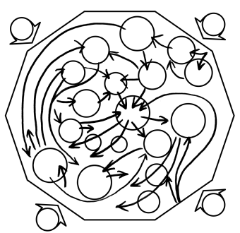

# @commonknowledge/common-\*



 [](https://codeclimate.com/github/commonknowledge/commons-react/test_coverage) [](https://codeclimate.com/github/commonknowledge/commons-react/maintainability)

A toolkit of React components and connect-style request handlers for rapidly building tools for organisers.

[**Documentation**](https://commonknowledge.github.io/commons-react/)

The idea is that as we work on projects, we extract our tried and tested patterns out into this library, so that they can be refined, easily re-used and viewed together to inform our design process.

It makes a few assumptions about the stack you're using:

- A React frontend, possibly server-side or statically rendered, using [theme-ui](https://theme-ui.com/) for styling.
- Backend consisting of simple, possibly serverless, connect-style request handlers.

It's developed with frameworks like [NextJS](https://nextjs.org/) in mind, but doesn't require you to use them.

Currently it includes:

- Frontend and backend components for:
  - Signups & registrations (@commonknowledge/common-subscriptions)
  - Accepting donations (@commonknowledge/common-donations)
  - Quickly building & styling forms (@commonknowledge/common-forms)
  - UI patterns we frequently use (@commonknowledge/common-ui)
- An abstraction over analytics providers, hooked into the above by default when relevant (@commonknowledge/common-analytics)
- Starters for theme-ui that incorporate our general design sensibility and support the above (@commonknowledge/common-themes).

## Quickstart

This is developed as a monorepo, so pick and choose the appropriate module:

(Not on npm just yet, install from git for now…)

```bash
yarn add 'https://gitpkg.now.sh/commonknowledge/commons-react/packages/ui?master'

yarn add 'https://gitpkg.now.sh/commonknowledge/commons-react/packages/donations?master'

yarn add 'https://gitpkg.now.sh/commonknowledge/commons-react/packages/subscriptions?master'

yarn add 'https://gitpkg.now.sh/commonknowledge/commons-react/packages/themes?master'

yarn add 'https://gitpkg.now.sh/commonknowledge/commons-react/packages/forms?master'
```

## Design principles

- Convention over configuration.
- Don't couple domain logic to cloud platforms. Make it easy to swap them out whenever possible.
- Only incorporate tried and tested patterns. Implementations should be well tested and documented.

## Developer Troubleshooting

> Error on building the repo:
>
> `Cannot find module '@commonknowledge/common-{...}' or its corresponding type declarations.`

We use Typescript's [project references](https://www.typescriptlang.org/docs/handbook/project-references.html) feature to build each of the packages in order. You need to make sure you've added the appropriate reference to the package’s `references` field before it can reference other packages in the repository.
